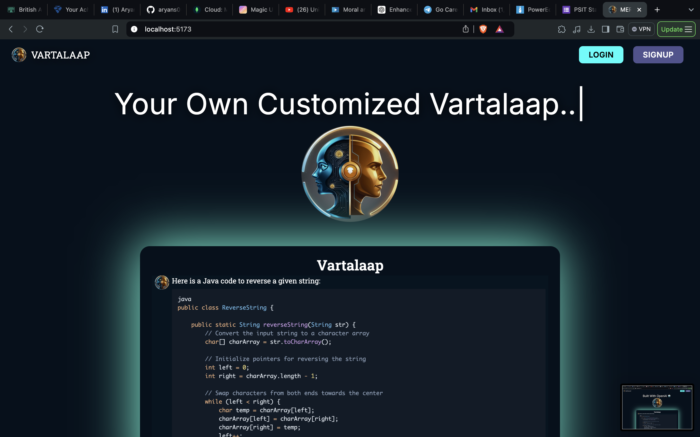
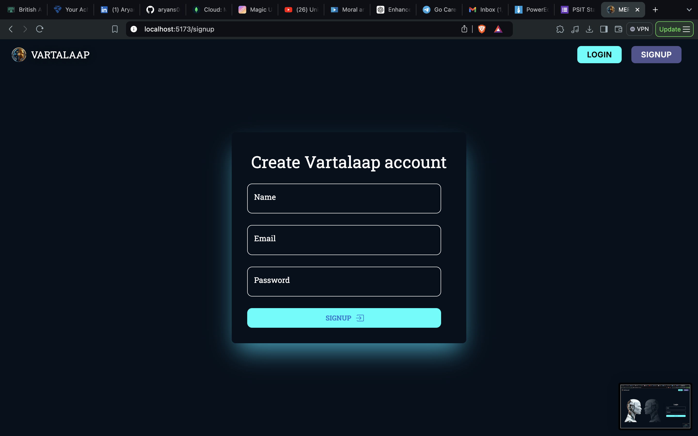
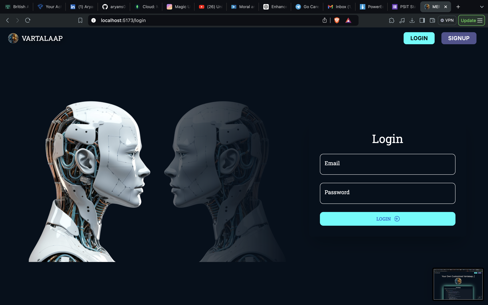
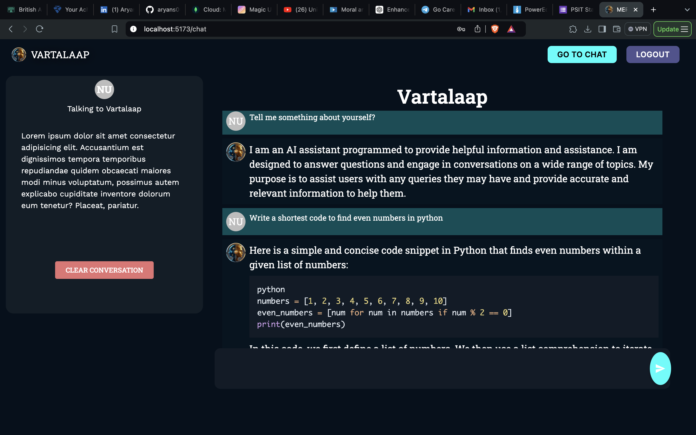

VARTALAAP AI Chatbot Web Application
VARTALAAP is an intelligent AI chatbot web application built using the MERN (MongoDB, Express.js, React, Node.js) stack.
This application leverages the power of OpenAI's API to provide meaningful and interactive conversations with users. 
The project focuses on creating a seamless user experience while incorporating essential features like authentication, security, and real-time interaction.

Features->
Interactive AI chatbot powered by OpenAI.
User authentication and authorization using JWT.
Secure password storage using bcrypt.
Responsive design for mobile and desktop.
Toast notifications for improved user experience.

Tech Stack->
Frontend: React, Material-UI, React Three Fiber, Axios
Backend: Node.js, Express.js, MongoDB, OpenAI API
Database: MongoDB
Authentication: JSON Web Tokens (JWT), bcrypt

Prerequisites->
Before you begin, ensure you have the following installed:
Node.js (v14.x or later)
npm or yarn
MongoDB (local or cloud-based)

Create a `.env` file->
PORT=8080
MONGO_URI=your_mongodb_connection_string
JWT_SECRET=your_jwt_secret_key
OPENAI_API_KEY=your_openai_api_key

